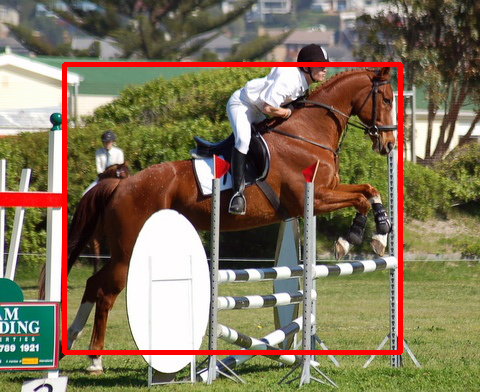

# LOST 
Implementación en PyTorch del método de descubrimiento de objetos no supervisado LOST. Más detalles se pueden encontrar en el artículo:

**Localizing Objects with Self-Supervised Transformers and no Labels**, BMVC 2021 [[arXiv](https://arxiv.org/abs/2109.14279)]  
by *Oriane Siméoni, Gilles Puy, Huy V. Vo, Simon Roburin, Spyros Gidaris, Andrei Bursuc, Patrick Pérez, Renaud Marlet and Jean Ponce*

<div>
  
  
  
</div>  

## Instalación de LOST
El código fuente de este repositorio y las pruebas de los experimentos fueron ejecutados en un WSL en Windows, luego de instalar el WSL se realizaron las siguientes verificaciones:

```
sudo apt update
sudo apt install python3-pip
```

Luego se instalaron las dependencias del proyecto y otras configuraciones ejecutando los siguientes comandos:

```
pip install -r requirements.txt
export PATH="$PATH:/home/ecanaza/.local/bin"
pip install torchvision
sudo apt-get install libgl1-mesa-glx
```

Antes de utilizar LOST verificar que los drivers de su tarjeta de video NVIDIA estén actualizados, de lo contrario pueden saltar error por incompatibilidad con las librerías instaladas.


## Aplicación de LOST a una imagen
A continuación se presentan scripts para aplicar LOST a una imagen definida mediante el parámetro `image_path` y visualizar las predicciones (`pred`), los mapas del artículo (`fms`) y la expansión de la semilla (`seed_expansion`). Las predicciones de las cajas también se almacenan en el directorio de salida proporcionado por el parámetro `output_dir`.

```
python3 main_lost.py --image_path examples/VOC07_000236.jpg --visualize pred
python3 main_lost.py --image_path examples/VOC07_000236.jpg --visualize fms
python3 main_lost.py --image_path examples/VOC07_000236.jpg --visualize seed_expansion
```

## Ejecución de LOST en conjuntos de datos

A continuación se detallan los pasos para reproducir los resultados de **LOST** presentados en el artículo.

Por favor, descargue los conjuntos de datos PASCAL VOC07 y PASCAL VOC12 ([enlace](http://host.robots.ox.ac.uk/pascal/VOC/)) y coloque los datos en la carpeta `datasets`. Deben existir dos subcarpetas: `datasets/VOC2007` y `datasets/VOC2012`. Para aplicar LOST y calcular los resultados de CorLoc (VOC07 61.9, VOC12 64.0), por favor ejecute:

```
python main_lost.py --dataset VOC07 --set trainval #VIT-S/16
python main_lost.py --dataset VOC07 --set trainval --patch_size 8 #VIT-S/8
python main_lost.py --dataset VOC07 --set trainval --arch vit_base #VIT-B/16
python main_lost.py --dataset VOC07 --set trainval --arch resnet50 #Resnet50/DINO
python main_lost.py --dataset VOC07 --set trainval --arch resnet50_imagenet #Resnet50/imagenet
```
Los resultados que se obtienen son los siguientes:

<table>
  <tr>
    <th>arch</th>
    <th>pre-training</th>
    <th colspan="3">dataset</th>
  </tr>
  <tr>
    <th></th>
    <th></th>
    <th>VOC07</th>
    <th>VOC12</th>
  </tr>
  <tr>
    <td>ViT-S/16</td>
    <td>DINO</td>
    <td>61.48</td>
    <td>64.06</td>
  <tr>
  <tr>
    <td>ViT-S/8</td>
    <td>DINO</td>
    <td>54.96</td>
    <td>56.99</td>
  <tr>
  <tr>
    <td>ViT-B/16</td>
    <td>DINO</td>
    <td>60.01</td>
    <td>63.35</td>
  <tr>
  <tr>
    <td>ResNet50</td>
    <td>DINO</td>
    <td>36.84</td>
    <td>42.68</td>
  <tr>
  <tr>
    <td>ResNet50</td>
    <td>Imagenet</td>
    <td>33.79</td>
    <td>39.06</td>
  <tr>
</table>

## License
LOST is released under the [Apache 2.0 license](./LICENSE).
